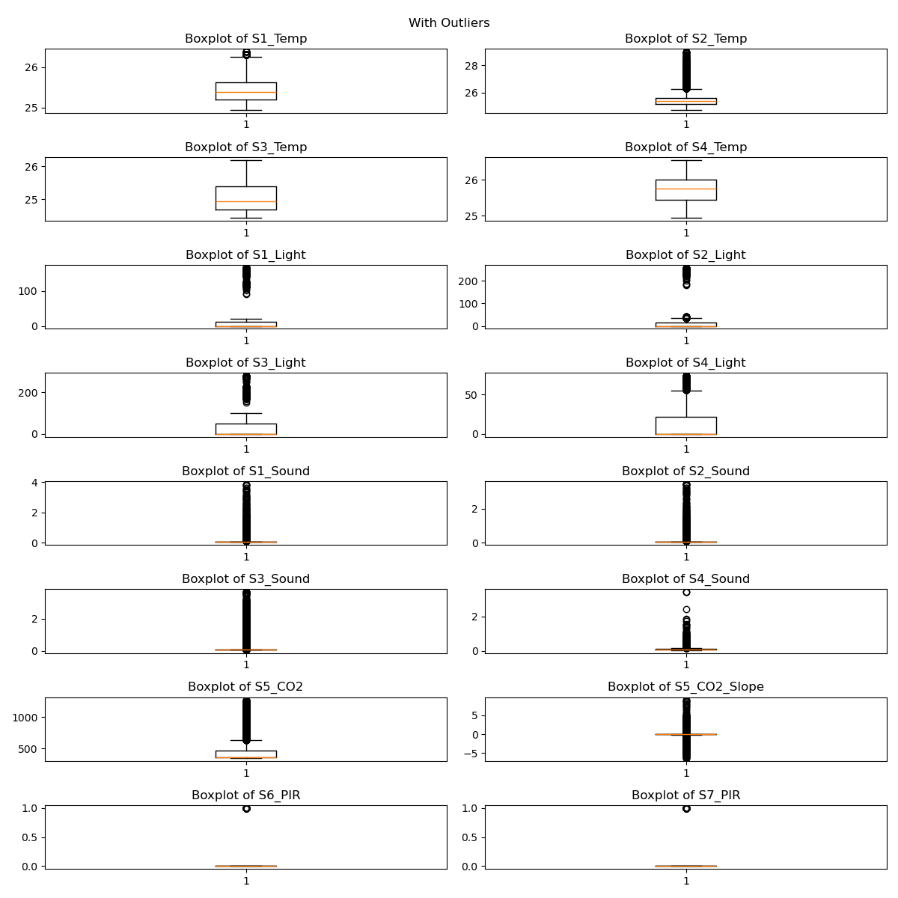
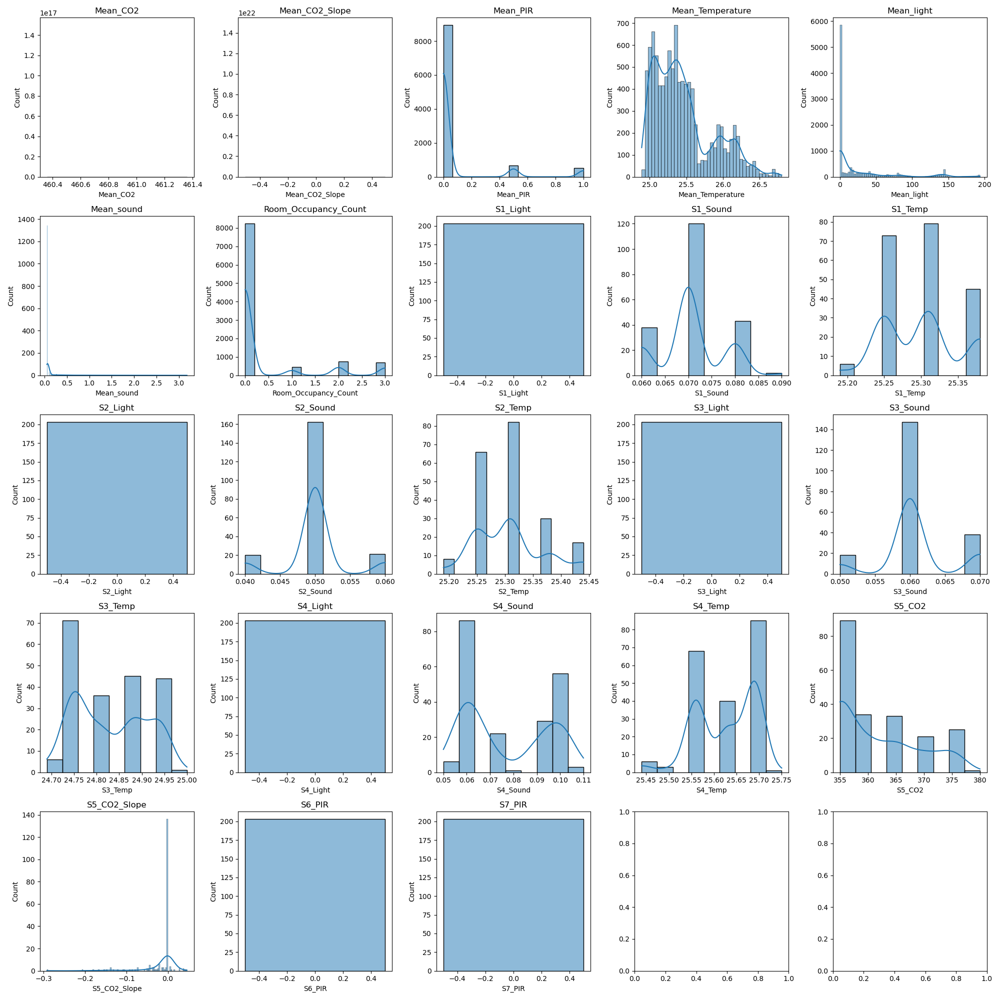
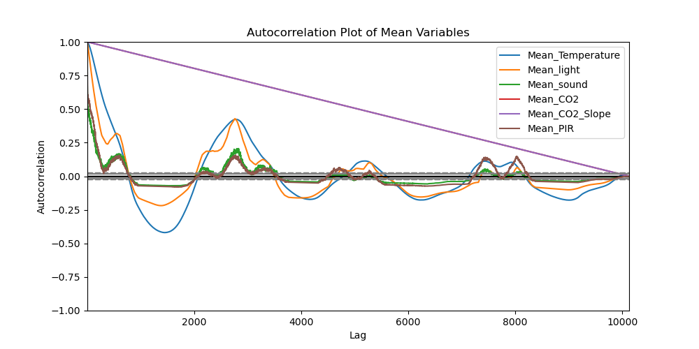
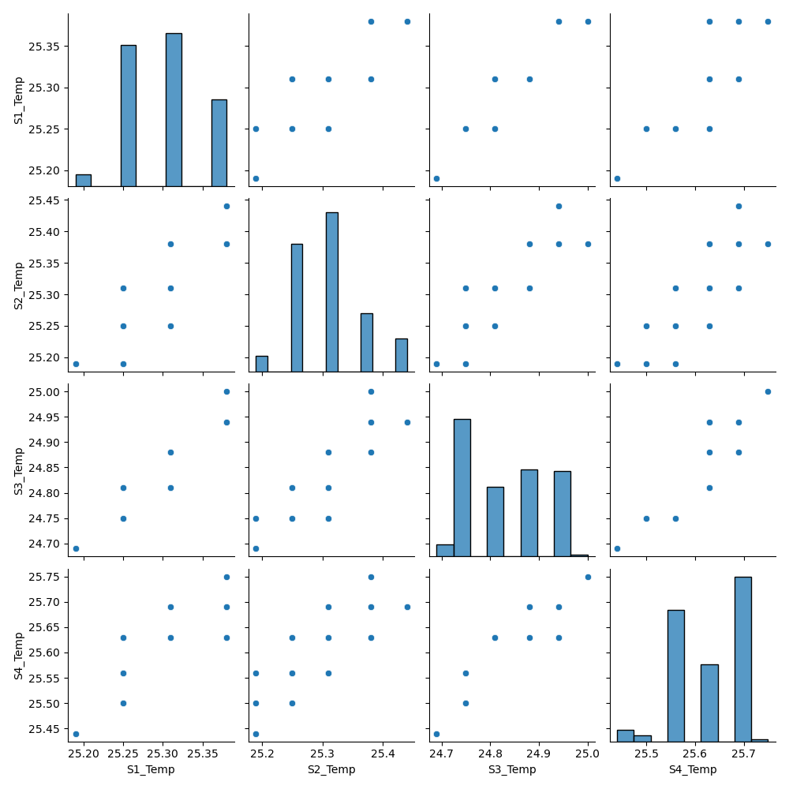

# Room Occupancy Estimation

This project aims to estimate room occupancy based on sensor data, including temperature, light, sound, CO2 levels, and PIR sensor readings. The data is processed and visualized to provide insights into room occupancy patterns.
Download and unzip [Dataset source](https://archive.ics.uci.edu/dataset/608/traffic+flow+forecasting) and save the unziped csv file under data/.

## Table of Contents

1. [Setup Instructions](#setup-instructions)
2. [Scripts Overview](#scripts-overview)
3. [Generated Plots](#generated-plots)
4. [Future Work](#future-work)


## Setup Instructions

1. **Clone the Repository**
    ```sh
    git clone git@github.com:invinciblesk/room_occupancy_estimation.git
    cd Room_Occupancy_Estimation
    ```

2. **Create and Activate a Virtual Environment**
    ```sh
    python -m venv venv
    source venv/bin/activate  # On Windows use `venv\Scripts\activate`
    ```

3. **Install Required Packages**
    ```sh
    pip install -r requirements.txt
    ```

4. **Run the Main Script**
    ```sh
    python src/main.py --data data/Occupancy_Estimation.csv --output output/
    ```

## Scripts Overview

### `main.py`

This is the main script that coordinates the data processing and visualization.

- **Functions**:
    - `main(data_file, output_dir)`: Loads and cleans the data, removes outliers, calculates mean values, and generates plots.
    - `with_outliers(df_cleaned, output_dir)`: Plots boxplots of sensor readings with outliers.
    - `without_outliers(df_raw, sensors, percentile, output_dir)`: Plots boxplots of sensor readings without outliers.

### `process_data.py`

This script handles data loading and cleaning.

- **Functions**:
    - `load_and_clean_data(filepath)`: Loads and cleans the data.
    - `calculate_mean_by_weekend(df_cleaned)`: Calculates mean values grouped by 'is_weekend'.
    - `remove_outliers(df_raw)`: Removes outliers using the Mahalanobis distance.

### `visualize_data.py`

This script handles data visualization.


## Analysis and Visualizations


### 1. Anomalies and Outlier Detection

We aim to identify any outliers in the sensor readings. The following boxplots represent the sensor readings, both with and without outliers, to help identify unusual readings.



**Observation:** Anomalies are observed in the dataset. We applied the mean and covariance of sensor data to normalize and remove these outliers.


### 2. Patterns and Environmental Conditions

We investigate how temperature, light intensity, sound levels, and CO2 levels correlate with room occupancy.



**Inference:** The intensity of temperature, light, sound, and CO2 directly affect room occupancy count.


**Autocorrelation over time



**Description:** By analyzing the relationship between sensor readings and occupancy, we can infer the conditions that coincide with higher or lower occupancy levels.

#### Weekdays vs. Weekends

We examine how sensor readings vary between weekdays and weekends.


**Inference:** No major variances in sensor readings are observed.

We also look at occupancy patterns between weekdays and weekends.


**Inference:** No major variances in occupancy are observed.

We further investigate if there are significant differences in occupancy or environmental factors.


**Description:** This plot illustrates the time series of sensor readings, highlighting differences between weekdays and weekends.

### 3. Patterns and Environmental Conditions

We aim to identify optimal environmental conditions that promote comfort and productivity based on occupancy data.



#### Correlation matrix

We also investigate if there are redundant sensors based on correlation analysis.


## Future Work

- Enhance the data processing pipeline to handle more complex scenarios.
- Improve the visualization techniques for better insights.
- Implement a machine learning model to predict room occupancy based on sensor data.


